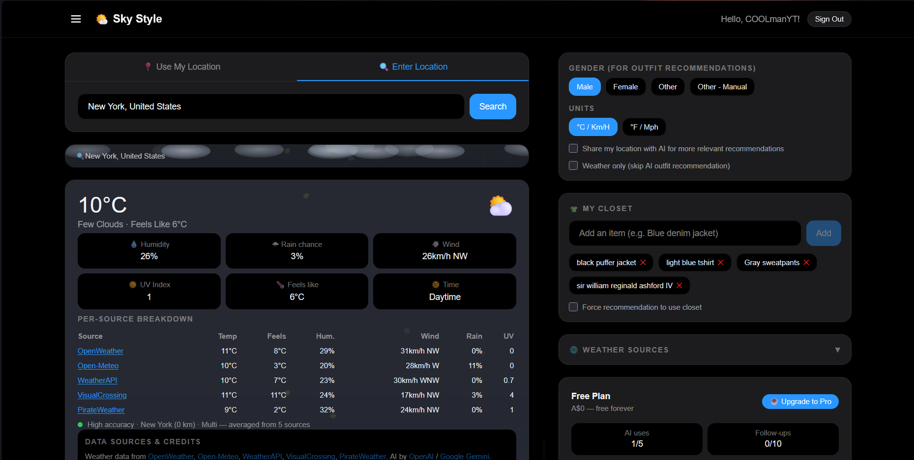
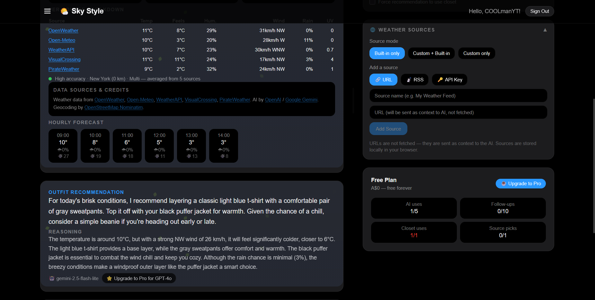
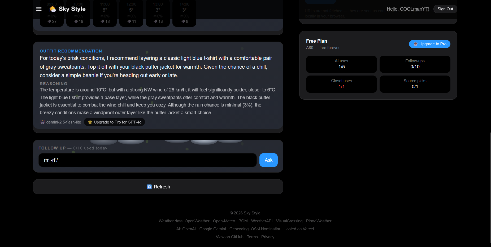
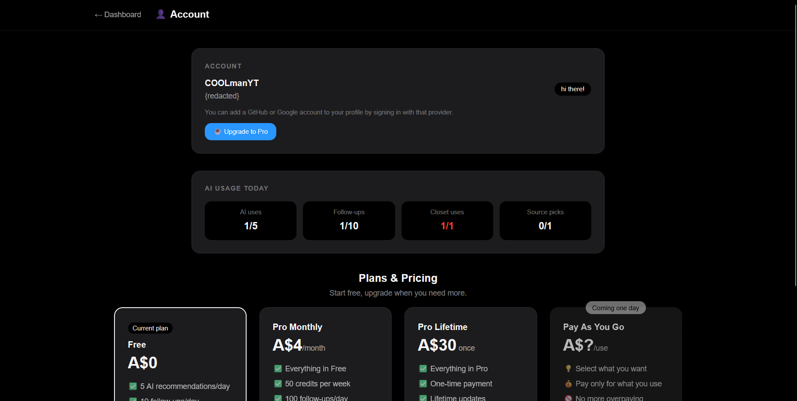
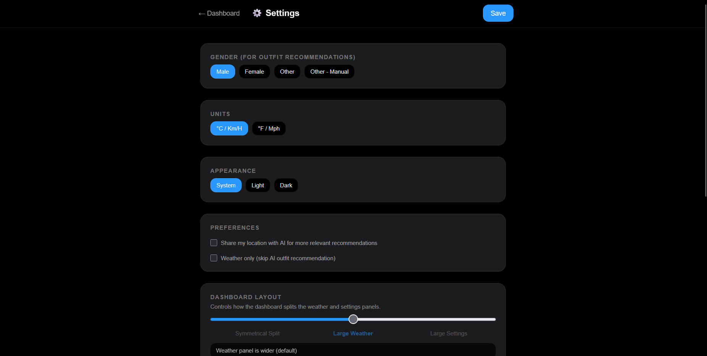

# skystyle (Sky Style) 🌤️

AI-powered outfit recommendations based on hyper-local weather data. Never overdress or underdress again.

Production domain: **https://skystyle.app**

[](https://buymeacoffee.com/coolmanyt)

## Features

- **Multi-source weather** — aggregates data from OpenWeatherMap, Open-Meteo, and Bureau of Meteorology (Australia) for accuracy, with hourly forecasts
- **AI outfit recommendations** — uses OpenAI GPT-4o or Google Gemini to suggest what to wear
- **Follow-ups** — ask follow-up questions like "should I bring an umbrella?" or "what if I need formal shoes?"
- **Digital closet** — add your wardrobe items so the AI knows what you own
- **Style / Shop** — full-width workspaces, with account-scoped browser preferences for both, Style-only, or Shop-only
- **Unified onboarding** — a replayable spotlight tour of the actual first-use controls
- **Shopping** — size, occasion, budget range, shared AI models, and sourced product cards; official eBay Australia search is gated on approved production credentials (direct retailer search remains available)
- **Bring Your Own Key** — Pro/Dev users can use OpenAI, Gemini, Mistral or Anthropic; keys stay in browser storage and are transmitted through the server for requested AI calls, not persisted in the database
- **Private style feedback** — record feedback in a modal; manage local/cloud storage and editable preference summaries in Settings
- **Health APIs** — bounded, cached public connectivity checks at `/api/v1/health`, `/db`, `/ai`, and `/weather`
- **Custom weather sources** — Pro users can add their own weather data sources
- **GPS & manual location** — use your browser's location or search for any city
- **Dark mode** — automatic, based on system preference

## Approved V6 plans — rollout inactive

These values are approved, not yet enforced. The server-only accounting foundation is installed with enforcement and checkout **disabled**. Current legacy allowances remain in effect until every charging path is replaced and verified; no subscription or credit purchase flow is available.

| | Free | Pro Monthly | Pay as you go |
|---|---|---|---|
| Price (AUD) | A$0 | A$6.99/month | A$5 minimum top-up; unavailable |
| Recommendations | 5/day and 60/month | 25/day and 250/month | 2 credits each |
| Follow-ups | 10/day and 120/month | 50/day and 500/month | 1 credit each |
| Active API keys | 3 | 20 | 20 |
| Account credit grant | 10 once at signup | 50 per admin-managed monthly period | None |
| Closet/source setup and editing | Unlimited | Unlimited | Unlimited |

Daily limits reset at 00:00 UTC; monthly caps use the UTC calendar month. Both caps apply. Style, Shop and automatic generations share recommendations. Included use does not double-spend credits or silently switch to metered use. Pro periods need exact verified dates, are not automatically renewed, and their grants expire at the period end. Signup/purchased credits have no scheduled expiry; purchased credits carry over. Expiring grants are consumed first. Credits are account-level after cutover, not new grants per API key.

Approved conversion: **50 credits per A$1**. Existing API endpoint costs stay recommend 2 / recweather 3 / weather 1 / closet 1 / health 0; no new premium/image charges. Donations are not plan purchases or top-ups.

Policy source: `apps/web/src/lib/entitlement-policy.ts`; transaction adapter: `entitlements.ts`; rollout bridge: `accounting.ts`. Active-accounting branches are integrated into Style, Shop, follow-ups, automatic generation, public API middleware and account/admin displays, but rollout remains off. Legacy enforcement currently remains Free 20 recommendations/day and 40 follow-ups/day, Pro daily App Credits, stable preview demo 200/400 and Dev unlimited. See [accounting status and cutover gates](apps/docs/development/v6-entitlements.md).

## Screenshots

| Dashboard | Weather Flow |
|---|---|
|  |  |

| Usage + Limits | Account + Security |
|---|---|
|  |  |



## Architecture

This repository is now organized as a single monorepo for multiple deployable projects.

```text
/
├── apps/
│   ├── web/        # Sky Style main app (Next.js)
│   ├── docs/       # VitePress docs website
│   └── api/        # Future standalone API placeholder (api.skystyle.app)
├── packages/       # Shared packages for future reuse
├── supabase/       # Database schema and SQL assets
└── ...root config files
```

Project targets:
- `apps/web` -> `skystyle.app` (or current preview domain)
- `apps/docs` -> `https://docs.skystyle.app`
- `apps/api` -> `api.skystyle.app` (future)

## Tech stack

- [Next.js](https://nextjs.org) 16 (App Router + Turbopack)
- [Supabase](https://supabase.com) (Postgres + Auth adapter)
- [NextAuth v5](https://authjs.dev) (GitHub + Google OAuth)
- [OpenAI](https://openai.com) / [Google Gemini](https://ai.google.dev) (AI)
- [OpenWeatherMap](https://openweathermap.org) + [Open-Meteo](https://open-meteo.com) (weather)
- [Tailwind CSS](https://tailwindcss.com) 4
- [Vercel](https://vercel.com) (hosting + analytics)

## Getting started

See **[SETUP.md](SETUP.md)** for full deployment and local development instructions.

Quick start:

```bash
cp .env.example apps/web/.env.local # or use vercel env pull
# fill in values in apps/web/.env.local
npm install
npm run dev
```

Docs quick start:

```bash
npm run docs:dev
```

## Security

- **SSRF protection** — custom weather source URLs are validated against private/internal hosts
- **HTTPS only** — custom source URLs must use HTTPS
- **No secrets in client** — all API keys are server-side only
- **BYOK keys are never stored** — user-provided AI API keys are used for the single request and discarded
- **Row Level Security** — Supabase RLS policies restrict data access to the owning user
- **JWT sessions** — NextAuth uses JWT strategy; the database adapter is wrapped in a safe fallback
- **Input validation** — coordinates, API inputs, and user content are validated before use
- **Rate limiting** — daily usage limits prevent abuse of AI and weather APIs

## Contributing

Issues and pull requests are welcome. Please be respectful and follow the [People First Design](https://github.com/COOLmanYT/people-first-design) principles.

## Legal

- [Terms of Service](/terms)
- [Privacy Policy](/privacy)

Both follow the [People First Design](https://github.com/COOLmanYT/people-first-design) principles — plain language, minimum data collection, no dark patterns.

## License

See [LICENSE](LICENSE).

## Support the project

If you like my project and want to support the development:

☕ Buy me a coffee  
https://buymeacoffee.com/coolmanyt

:)
